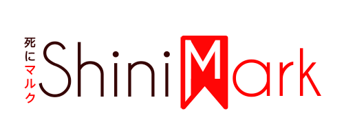

<p align="center">
  
</p>

# shiniMark


[](http://shinimark.epizy.com)
[](http://makeapullrequest.com)

A personal bookmark management site using AJAX & PHP


## Languages and Frameworks

1. Languages
   
   * PHP
   
   * AJAX
    
   * mySQL
   
   * CSS3
   
1. Frameworks & Libraries 
   
   * Bootstrap4

## Clone Repo

#### HTTPS

```
https://github.com/hind-sagar-biswas/shiniMark.git
```

#### SSH

```
git@github.com:hind-sagar-biswas/shiniMark.git
```

#### Git CLI

```
gh repo clone hind-sagar-biswas/shiniMark
```


## License

This code has been licensed under `GNU AGPLv3` open source copyleft license. 

## Author

*Hind Sagar Biswas*

**Website:** [hindbiswas.000webhostapp.com/](https://hindbiswas.000webhostapp.com/)

**Repls:** [replit.com/@HindBiswas](https://replit.com/@HindBiswas)

[](https://m.facebook.com/hindsagar.biswas)
[](https://twitter.com/hind_biswas)
